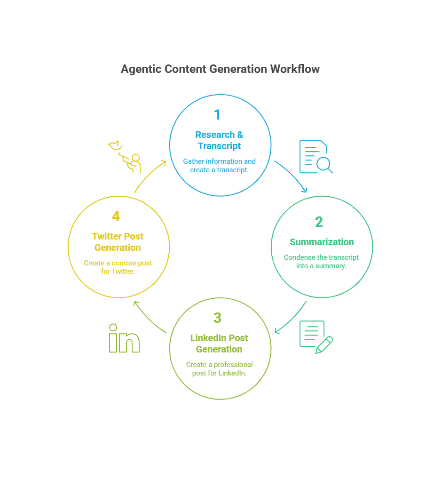
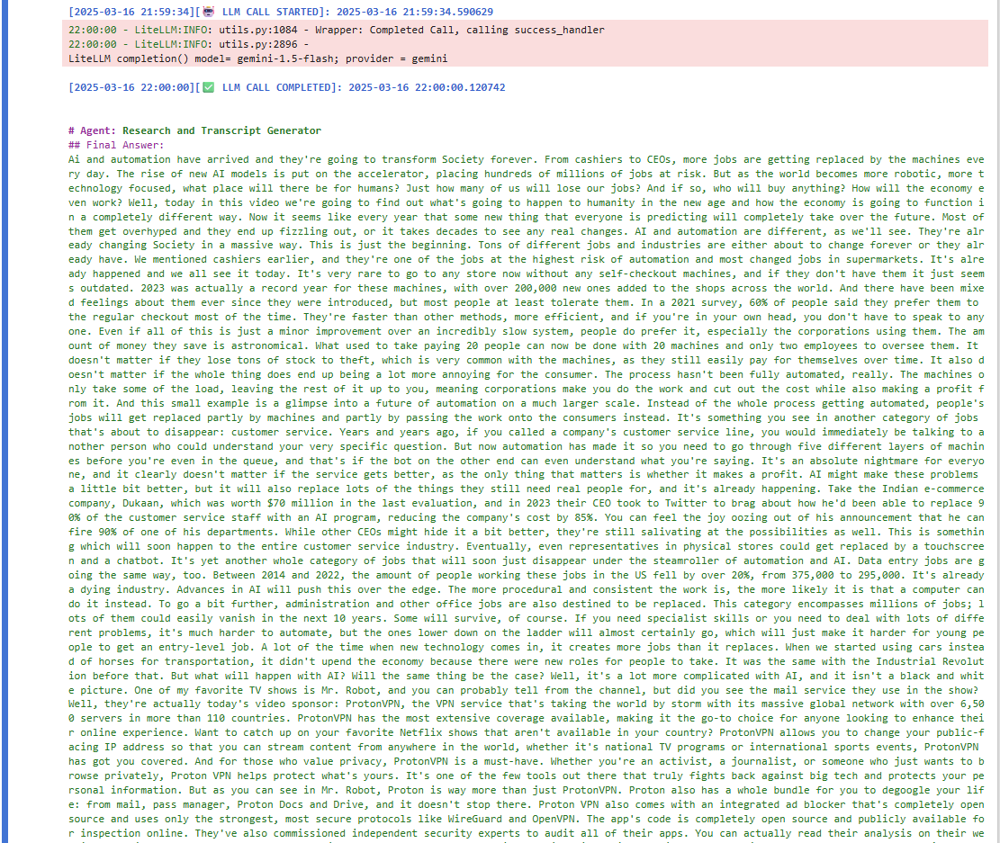
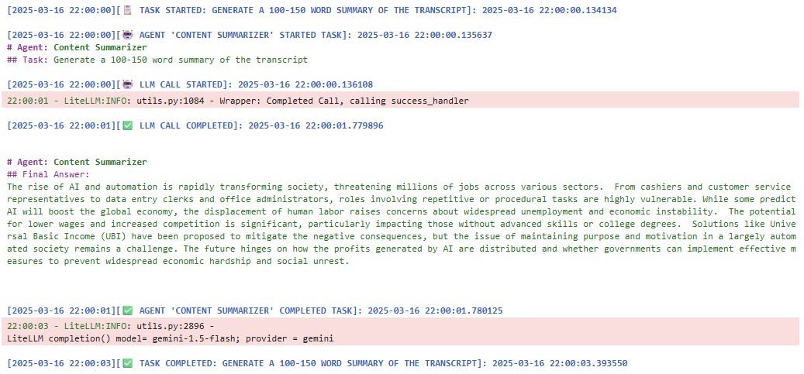
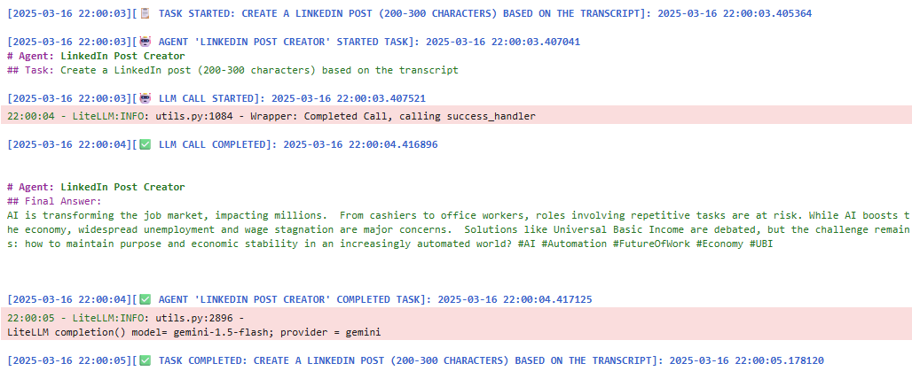
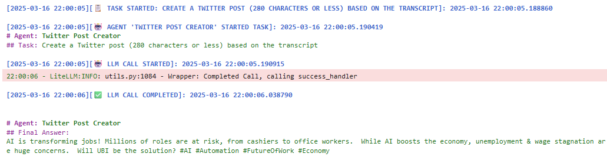

# Agentic-Content-Generation-System

## Overview
This repository contains a CrewAI-based system that leverages multiple AI agents to collaboratively generate content from a user-provided topic. The system automates the process of researching, transcribing, summarizing, and creating social media posts, demonstrating the power of agentic AI workflows. This project highlights the integration of AI agents to streamline content creation tasks, showcasing modularity, scalability, and efficiency.

## Problem Statement
In the digital age, content creation is a time-consuming process involving research, summarization, and crafting platform-specific posts. Manual workflows are inefficient and prone to errors, especially when handling large volumes of information. The challenge is to develop an automated system that:

- Researches relevant content based on a user-provided topic.
- Generates a transcript from source material (e.g., YouTube videos).
- Summarizes the transcript into a concise format.
- Creates tailored social media posts for platforms like LinkedIn and Twitter (X).

This project addresses these needs by implementing a multi-agent system using CrewAI, where each agent handles a specific task, working collaboratively to produce high-quality outputs efficiently.

---

## What is an AI Agent?
An AI agent is an autonomous software entity designed to perform specific tasks, make decisions, and interact with other agents or systems to achieve a goal. In this context, agents are powered by large language models (LLMs) and operate within the CrewAI framework, which facilitates task delegation and collaboration. Each agent is assigned a role (e.g., researcher, summarizer) and uses tools like web search or LLMs to execute its tasks.

## How Agents Help
- **Modularity**: Each agent focuses on a single task, making the system easy to maintain and extend.
- **Efficiency**: Agents work in parallel or sequentially, automating repetitive tasks and reducing manual effort.
- **Scalability**: Additional agents or tools can be integrated to handle more complex workflows.
- **Collaboration**: Agents share outputs, enabling a cohesive workflow where each step builds on the previous one.
- **Accuracy**: Specialized agents ensure high-quality, task-specific results (e.g., concise summaries or platform-tailored posts).

---

## Why CrewAI and What It Does

**CrewAI** is a powerful Python-based framework designed to orchestrate multi-agent systems, enabling seamless collaboration among AI agents to accomplish complex tasks. It was chosen for this project due to its:

- **Ease of Use**: CrewAI provides a simple interface to define agent roles, tasks, and workflows, making it ideal for rapid development and iteration.
- **Flexibility**: It supports integration with various APIs and LLMs (e.g., Gemini, OpenAI), allowing customization to suit specific project needs.
- **Scalability**: CrewAI’s modular design enables easy addition of new agents or tools, ensuring the system can evolve with future requirements.
- **Collaboration Focus**: It facilitates agent-to-agent communication, ensuring outputs from one agent (e.g., a transcript) are seamlessly passed to others (e.g., for summarization).
- **Robustness**: Built-in error handling and task management ensure reliable execution, as demonstrated by the system’s ability to handle YouTube API calls and LLM-based text generation.

### What CrewAI Does

CrewAI acts as the backbone of this system, coordinating four specialized agents to process a user-provided topic. It manages the workflow, from fetching content to generating social media posts, by defining agent roles, assigning tasks, and handling data flow between agents. This ensures a streamlined process where each agent’s output is optimized for the next step, showcasing the power of agentic AI in automating complex, multi-step tasks.

---

## System Implementation
This project implements a CrewAI-based multi-agent system to automate content generation. The system consists of four specialized agents, each handling a distinct task:

### Research & Transcript Generation Agent:
- **Input**: User-provided topic (e.g., "Impact of AI on Jobs").
- **Task**: Searches for relevant content on platforms like YouTube using APIs (e.g., google-api-python-client).
- **Output**: Generates a transcript of the content, extracting key information for further processing.
- **Tools**: YouTube API for content retrieval, text processing for transcription.

### Summarization Agent:
- **Input**: Transcript from the Research Agent.
- **Task**: Produces a concise summary (100-150 words) capturing the core ideas of the transcript.
- **Output**: A clear, readable summary suitable for reports or further content creation.
- **Tools**: LLM (e.g., Gemini-1.5-flash via litellm) for text summarization.

### LinkedIn Post Generator Agent:
- **Input**: Transcript.
- **Task**: Crafts a professional LinkedIn post (200-300 characters) tailored to the platform’s audience.
- **Output**: A post with relevant hashtags to maximize engagement.
- **Tools**: LLM for text generation, optimized for LinkedIn’s tone and character limits.

### Twitter Post Generator Agent:
- **Input**: Transcript.
- **Task**: Creates a Twitter (X) post (280 characters or less) designed for brevity and impact.
- **Output**: A concise post with hashtags to enhance visibility.
- **Tools**: LLM for text generation, adhering to Twitter’s character constraints.

## Implementation Details
- **Framework**: CrewAI, a Python-based framework for orchestrating multi-agent workflows.
- **Dependencies**: Installed via `pip install crewai google-api-python-client google-generativeai` (see notebook for full dependency list).
- **Environment**: Python 3.10.12, executed on a Kaggle notebook with NVIDIA Tesla T4 GPU support.
- **Execution**: The system processes a topic, generates a transcript, summarizes it, and produces social media posts in a single workflow.

### Output Example:
- **Topic**: Impact of AI on Jobs.
- **Transcript**: A detailed discussion on AI’s transformative effects on jobs, including examples like self-checkout machines and customer service automation.
- **Summary**: A 100-150 word summary highlighting job displacement risks and potential economic impacts.
- **LinkedIn Post**: “AI is transforming the job market, impacting millions... #AI #Automation #FutureOfWork”
- **Twitter Post**: “AI is transforming jobs! Millions at risk... #AI #Automation #Economy”

## Workflow Diagram
Below is a visual representation of the agentic workflow:

*Figure: The CrewAI system delegates tasks to four agents, each processing the input sequentially to produce a transcript, summary, and social media posts.*

---

## Applications and Impact
This system demonstrates the power of agentic AI for content creation and has broad applications:

- **Content Marketing**: Automate blog post drafts, social media campaigns, or newsletters based on trending topics.
- **Education**: Generate summaries and social media content for academic research or online courses.
- **Journalism**: Quickly research and summarize news topics, creating shareable posts for media outlets.
- **Corporate Communications**: Streamline internal reports or external announcements by summarizing key insights and crafting posts.
- **Personal Branding**: Help professionals create consistent, high-quality social media content to boost their online presence.

The system is extensible, allowing for additional agents (e.g., for Instagram posts or email drafts) or integration with other APIs for enhanced research capabilities.

---

## Results
The system successfully processes a user-provided topic, such as "Impact of AI on Jobs," and produces the following outputs:

- **Transcript**: A detailed text extracted from a YouTube video discussing AI’s impact on various job sectors.
  

*Figure: Generated transcript from a YouTube video on AI’s impact on jobs.*

- **Summary**: A concise 100-150 word summary capturing key points, such as job displacement risks and economic implications.

*Figure: 100-150 word summary produced by the Summarization Agent.*

- **LinkedIn Post**: A 200-300 character post, e.g.,  
  _“AI is transforming the job market, impacting millions. From cashiers to office workers, roles involving repetitive tasks are at risk... #AI #Automation #FutureOfWork #Economy #UBI.”_

*Figure: LinkedIn post crafted by the LinkedIn Post Generator Agent.*

- **Twitter Post**: A 280-character post, e.g.,  
  _“AI is transforming jobs! Millions of roles are at risk, from cashiers to office workers. While AI boosts the economy, unemployment & wage stagnation are huge concerns. Will UBI be the solution? #AI #Automation #FutureOfWork #Economy.”_

*Figure: Twitter post created by the Twitter Post Generator Agent.*

---

## Future Enhancements
- **Additional Agents**: Add agents for other platforms (e.g., Instagram, Medium) or content types (e.g., blog posts).
- **Improved Research**: Integrate more data sources (e.g., news APIs, academic databases).
- **Multimodal Outputs**: Generate images or infographics alongside text outputs.
- **User Interface**: Develop a web or CLI interface for easier topic input and result visualization.

